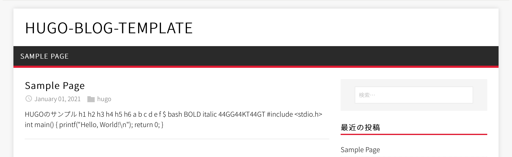

HUGOを使ったブログを簡単に作成するためのテンプレートです


## forkするだけでできること
- GitHub Actionsによる自動デプロイ
- GitHub Pagesに公開

## セットアップ

### HUGOの設定
`config.toml`を編集してhugoの設定をします  
`$ hugo serve`を実行してページのプレビューを確認できます  

#### Baseurl
```
baseURL = "https://{Github ユーザー名}.github.io/{forkしたリポジトリ名}"
```
#### ブログのタイトル
```
title = "hugo-blog-template"
```

#### 自己紹介
```
[Author]
    name = "Author"
    bio = "ここに自己紹介を入れることができます"
    avatar = "img/avatar.png"
```
アバターの画像は`static/img/avatar.png`に配置しています

#### ページのテーマカラー
```
[Params.style.vars]
  highlightColor = "#e22d30"
```
`#rrggbb`の形式で指定してください

#### SNS等のユーザー名
```
[Params.widgets.social]
  twitter = "uvrub"
  github = "kato-k"
```
アカウントIDを指定するとサイドバーに表示されます

### GitHub Pagesの設定
`config.toml`の変更をリモートリポジトリに反映すると、GitHub Actionsによってページのビルドが走ります。  
ビルド結果は`github-actions[bot]`によって`gh-pages`ブランチにコミットされます。  

#### ページの公開
リポジトリの`Settings`タブ→`Pages`を開いてください。  

画像の四角で囲った部分を`gh-pages`に変更し、`save`をクリックすると公開が始まります。  
アクセスできるようになるまで10分程度間があります。